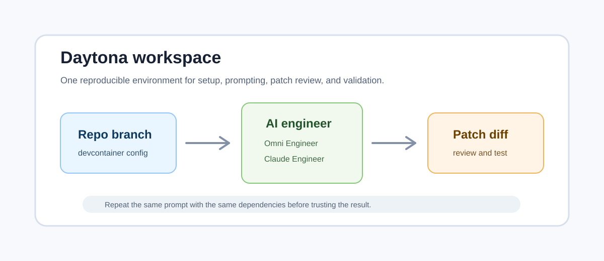

# Run AI Engineer Rehearsals in Daytona

## Introduction

AI coding tools are easiest to evaluate when the environment stays the same.
If one agent runs on a laptop with old packages, another runs in a fresh virtual
environment, and a third runs without the same API keys, the comparison is not
about the agents anymore. It is about drift. A repeatable
[development container](/definitions/20240819_definition_development%20container.md)
keeps that noise out of the experiment.

This article shows how to run two open source AI engineer projects in Daytona:
[Omni Engineer](https://github.com/Doriandarko/omni-engineer) and
[Claude Engineer](https://github.com/Doriandarko/claude-engineer). The goal is
not to let an agent push directly to production. The goal is to create a
controlled [prompt-to-patch workflow](/definitions/20260528_definition_prompt_to_patch_workflow.md)
where each agent receives the same task, produces a proposed patch, and leaves
the developer with a diff that can be reviewed and tested.

The companion setup work is available in two pull requests:
[Doriandarko/omni-engineer#38](https://github.com/Doriandarko/omni-engineer/pull/38)
adds a Daytona-ready devcontainer for Omni Engineer, and
[Doriandarko/claude-engineer#262](https://github.com/Doriandarko/claude-engineer/pull/262)
adds the same kind of workspace entry point for Claude Engineer.



## TL;DR

- Use Daytona to create a clean workspace for each AI engineer project.
- Forward only the API keys each tool needs from your local machine.
- Give both agents the same small, reviewable coding task.
- Compare the generated diffs, then run the same validation command in each
  workspace before accepting either patch.

## Why Rehearse AI Engineering Work

AI coding agents are useful when they shorten the path from intent to reviewed
code. They are risky when the developer cannot reproduce how the patch was
created. A rehearsal makes the workflow observable. You keep the prompt, the
repository state, the dependency install, the generated diff, and the validation
commands close together.

That structure matters for teams adopting AI-assisted development. Without it,
one successful demo can hide fragile setup steps. With it, a maintainer can
rerun the same task after a package update, compare models, or ask a second
agent to solve the same issue without changing the surrounding environment.

Daytona is a good fit because the workspace can be tied to repository setup
instead of an individual's laptop. When the repository has a devcontainer, the
workspace knows which base image to use, which dependencies to install, which
ports to expose, and which environment variables must be passed in at runtime.

## Workspace Layout

The Omni Engineer devcontainer uses a Python 3.11 image, installs the project's
`requirements.txt`, and forwards `OPENROUTER_API_KEY` from the local machine.
That matches Omni Engineer's OpenRouter-based client setup and keeps the key out
of the repository. The attach command compiles `main.py` so a syntax problem is
caught as soon as the workspace opens.

The Claude Engineer devcontainer also uses Python 3.11 and installs from
`requirements.txt`. It forwards `ANTHROPIC_API_KEY` for Claude access and
`E2B_API_KEY` for the optional code execution tool. It also forwards port
`5000`, which is the Flask web interface documented by Claude Engineer.

Both setup files intentionally avoid committing `.env` files. The workspace
should receive secrets from the developer's machine or from a secret manager.
That makes the setup reusable without turning the repository into a storage
place for personal credentials.

## Step 1: Prepare Local Keys

Export the keys you plan to use before opening the Daytona workspace. For Omni
Engineer, set OpenRouter:

```bash
export OPENROUTER_API_KEY="your-openrouter-key"
```

For Claude Engineer, set Anthropic and, if needed, E2B:

```bash
export ANTHROPIC_API_KEY="your-anthropic-key"
export E2B_API_KEY="your-e2b-key"
```

If you are testing the companion branches before they are merged, create a
workspace from your fork or select the branch that contains
`.devcontainer/devcontainer.json` in your Daytona project configuration. After
the pull requests are merged, the upstream repositories can be used directly.

## Step 2: Open Omni Engineer in Daytona

Create a workspace for Omni Engineer:

```bash
daytona create https://github.com/Doriandarko/omni-engineer --code
```

When the devcontainer is present, Daytona builds the Python workspace and runs
the dependency install command. From the workspace terminal, start the console:

```bash
python main.py
```

Use a small task for the first rehearsal. A good prompt asks for a narrow
change, names the file, and defines the validation command. For example:

```text
Add a --version command that prints the package version. Keep the change
minimal. After editing, show the diff and run python -m compileall main.py.
```

The point is not to make the agent solve the largest possible feature. The point
is to observe how it gathers context, edits the file, reports the diff, and
responds to a failing validation command.

## Step 3: Open Claude Engineer in Daytona

Create a separate workspace for Claude Engineer:

```bash
daytona create https://github.com/Doriandarko/claude-engineer --code
```

Start either the web interface or the CLI:

```bash
python app.py
```

```bash
python ce3.py
```

The web interface is useful when you want a browser-based chat surface and
visual token feedback. The CLI is better for terminal-heavy work where the diff
and validation commands are the main focus.

Give Claude Engineer the same task you used with Omni Engineer. Keep the
repository state equivalent. If one workspace has local edits, reset or recreate
it before comparing results. Otherwise, you are measuring the difference between
starting states instead of the difference between agent behavior.

## Step 4: Compare the Diffs

After each agent finishes, inspect the patch before running it:

```bash
git diff
```

Look for three things. First, check scope. The diff should touch only the files
needed for the prompt. Second, check reversibility. A small patch is easier to
discard or revise than a broad rewrite. Third, check explanation quality. A
good AI engineer should be able to tell you what it changed, why it changed it,
and how it validated the result.

Then run the validation command in the same workspace where the patch was
created. For these repositories, a fast first check is Python compilation:

```bash
python -m compileall main.py
```

For Claude Engineer, include the main entry points and tool directories:

```bash
python -m compileall app.py ce3.py config.py tools prompts
```

Compilation does not prove the behavior is correct, but it catches syntax
errors before you spend time on manual review. For a real contribution, add the
project's test command or a targeted smoke test.

## Step 5: Keep the Best Patch

Once both agents have produced a patch, keep the version that is smallest,
clearest, and easiest to validate. If neither patch is good, that is still a
useful result. The rehearsal exposed a task that needs a better prompt, more
context, or a human implementation.

For team use, save the prompt, agent name, model, validation command, and final
diff in the issue or pull request. That record turns an AI-generated patch into
an auditable engineering artifact. Future reviewers can see the same inputs and
rerun the same checks in Daytona.

## Conclusion

Omni Engineer and Claude Engineer can both be useful coding assistants, but they
are more valuable when they run inside a controlled environment. Daytona gives
each tool a repeatable workspace, forwards only the secrets it needs, and keeps
the generated patch close to the validation commands.

Use this pattern for small, reviewable tasks first. Once the team trusts the
workflow, expand it to more complex fixes, test generation, and documentation
updates. The discipline stays the same: stable environment, clear prompt, small
diff, explicit validation, and human review before merge.

## References

- [Omni Engineer](https://github.com/Doriandarko/omni-engineer)
- [Claude Engineer](https://github.com/Doriandarko/claude-engineer)
- [Omni Engineer Daytona devcontainer PR](https://github.com/Doriandarko/omni-engineer/pull/38)
- [Claude Engineer Daytona devcontainer PR](https://github.com/Doriandarko/claude-engineer/pull/262)
