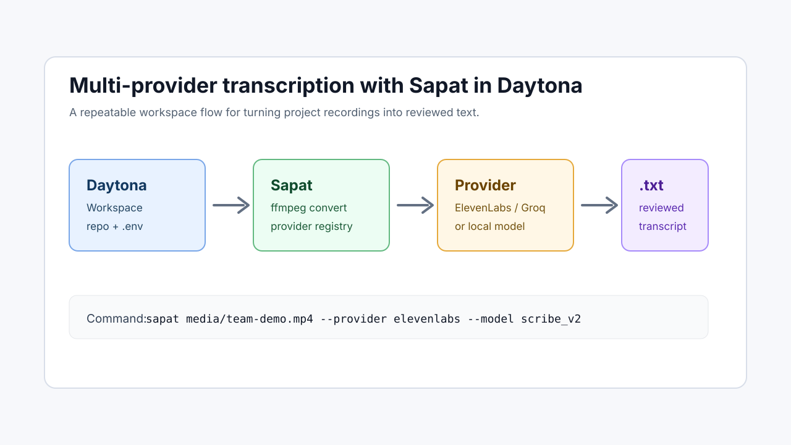

# Run Multi-Provider Transcription with Sapat

## Introduction

Project recordings become useful when the team can search, review, quote, and
summarize what was said. Demo videos, customer calls, design reviews, and
engineering standups often hold decisions that never make it into tickets. A
repeatable [speech-to-text API](/definitions/20260528_definition_speech_to_text_api.md)
workflow turns those recordings into text before the context is lost.

This guide shows how to run [Sapat](https://github.com/nibzard/sapat) in a
[Daytona workspace](</definitions/20240819_definition_daytona workspace.md>)
after its provider plugin architecture update. Sapat still handles the local
work: it converts media with `ffmpeg`, sends the converted audio to a configured
provider, and writes a `.txt` transcript next to the source file. The newer
provider registry makes that workflow easier to adapt because Sapat discovers
only the providers that are actually available in your environment.

That discovery behavior is useful inside Daytona. A workspace can carry the
same repository, package install, `.env` shape, and command history for every
engineer who needs to rerun a transcription. Instead of remembering which
provider was wired on one laptop, the team can open the workspace, check which
providers Sapat sees, run one short sample, and then scale up to a batch.



## TL;DR

- Create a Daytona workspace from the Sapat repository.
- Install Sapat in editable mode so the workspace uses the current provider
  registry.
- Add the API key for one provider, such as `ELEVENLABS_API_KEY`, to `.env`.
- Confirm Sapat discovers that provider with `sapat --help`.
- Run `sapat` with `--provider`, review the generated `.txt`, then process a
  small batch once the output quality is acceptable.

## Prerequisites

You need the following before starting:

- Daytona installed locally. If it is not installed yet, run:

```bash
curl -L https://download.daytona.io/daytona/install.sh | sudo bash
```

- `ffmpeg` available in the workspace. Sapat uses it to convert the source
  media into the provider's preferred audio format.
- A short `.mp4` recording for the first test. Start with one to three minutes
  so you can validate credentials, quality, and output shape without spending
  unnecessary provider credits.
- At least one provider credential. This guide uses ElevenLabs as the concrete
  example because Sapat's current provider registry includes an `elevenlabs`
  provider that calls the Scribe speech-to-text API.

Sapat only exposes a provider when its required environment variables and
optional packages are present. That means a clean workspace with no `.env` may
show no usable provider. Treat that as a configuration check, not as a broken
install.

## Step 1: Create the Daytona Workspace

Create a workspace from the Sapat repository:

```bash
daytona create https://github.com/nibzard/sapat --code
```

Inside the workspace, make sure you are on the latest main branch:

```bash
git pull --ff-only origin main
```

Install Sapat in editable mode:

```bash
python -m pip install -e ".[dev]"
```

Editable mode is helpful while validating a transcription workflow because the
CLI, provider registry, and local tests all run from the checked-out source. If
the workspace uses a virtual environment, activate it before installing:

```bash
python -m venv .venv
source .venv/bin/activate
python -m pip install -U pip
python -m pip install -e ".[dev]"
```

Confirm the command is installed:

```bash
sapat --version
```

You should see the current Sapat version rather than a shell error.

## Step 2: Configure a Provider

Create a local `.env` file in the workspace root. For ElevenLabs:

```bash
cat > .env <<'EOF'
ELEVENLABS_API_KEY=replace_with_your_key
EOF
```

Keep `.env` local and do not commit it. Sapat loads environment variables at
runtime and uses them to decide which providers are available.

The same pattern works for other providers in the registry. Add only the
credentials you intend to use:

| Provider | Minimum configuration | Notes |
| --- | --- | --- |
| `elevenlabs` | `ELEVENLABS_API_KEY` | Uses ElevenLabs Scribe models such as `scribe_v2`. |
| `groq` | `GROQ_API_KEY` | Good for fast Whisper-compatible transcription. |
| `deepinfra` | `DEEPINFRA_API_KEY` | Uses an OpenAI-compatible transcription surface. |
| `whisper_cpp` | `WHISPER_CPP_BINARY`, `WHISPER_CPP_MODEL_PATH` | Runs locally when the binary and model are installed. |
| `vosk` | `VOSK_MODEL_PATH` plus optional package install | Local/offline option for constrained environments. |

Do not add provider keys that are not needed for the current run. Smaller
configuration makes debugging easier, and it prevents the CLI from selecting an
unexpected default when more than one provider is available.

## Step 3: Verify Provider Discovery

Run the help command from the workspace root:

```bash
sapat --help
```

Look for the `--provider` option. The provider list is dynamic, so the exact
available set depends on your `.env` and optional dependencies. With the
ElevenLabs key configured, `elevenlabs` should be accepted as a provider:

```bash
sapat media/team-demo.mp4 --provider elevenlabs --help
```

If `elevenlabs` is not available, check that `.env` is in the same directory
where you run the command and that the variable name is exactly
`ELEVENLABS_API_KEY`.

## Step 4: Run a First Transcription

Place a small recording in the workspace:

```bash
mkdir -p media
cp ~/Downloads/team-demo.mp4 media/team-demo.mp4
```

Run Sapat with the configured provider:

```bash
sapat media/team-demo.mp4 \
  --provider elevenlabs \
  --model scribe_v2 \
  --language en \
  --quality M \
  --temperature 0
```

Sapat does four things:

1. Converts `media/team-demo.mp4` into a temporary provider-ready audio file.
2. Loads the `elevenlabs` provider from the registry.
3. Sends the audio to the configured speech-to-text API.
4. Writes the returned transcript to `media/team-demo.txt`.

Open the generated text:

```bash
sed -n '1,80p' media/team-demo.txt
```

For the first pass, review structure instead of trying to perfect every word.
Check that the language is correct, the transcript is not empty, the topic flow
matches the recording, and there are no repeated hallucinated phrases. If the
first run fails, fix credentials or file size before changing models.

## Step 5: Tune Quality and Model Choice

Sapat's `--quality` flag controls the temporary audio generated by `ffmpeg`.
That temporary file is what the provider receives, so the flag affects upload
size, cost risk, and recognition detail.

| Quality | Best for | Tradeoff |
| --- | --- | --- |
| `L` | Long calls, cheap smoke tests, noisy experiments | Smaller payload with less acoustic detail. |
| `M` | Most demos, interviews, and team recordings | Balanced size and clarity. |
| `H` | Short clips where exact wording matters | Larger payload and higher request risk. |

Start with `M` for normal project recordings. Use `L` when the file is long or
when a provider rejects the request size. Use `H` only after a short clip proves
that the provider, model, and account are configured correctly.

The `--model` value is provider-specific. For ElevenLabs, Sapat defaults to
`scribe_v2`; for other providers, use the model names supported by that
provider. Keep the model explicit in team runbooks so another engineer can
reproduce the same result later.

## Step 6: Process a Small Batch

After one file works, process a small directory:

```bash
sapat media/ \
  --provider elevenlabs \
  --model scribe_v2 \
  --language en \
  --quality M \
  --temperature 0
```

Sapat processes `.mp4` files in the directory and writes one `.txt` file beside
each source video. Keep the first batch small. Five short files are enough to
confirm provider limits, naming behavior, and output quality before running an
archive of meeting recordings.

For long recordings, Sapat can split converted audio when it exceeds the
provider's configured size limit. Even with splitting, smaller source files are
easier to retry and review. If a meeting is an hour long, segment it around
natural agenda breaks before transcription.

## Step 7: Add Review Guardrails

Raw transcripts are useful, but they should not be treated as final records
without a quick human pass. Speech-to-text systems can miss product names,
merge speakers, flatten emphasis, or add punctuation that changes meaning. For
engineering work, use a short review routine:

1. Store the original recording and generated transcript side by side.
2. Add a header with the recording date, source, provider, model, and reviewer.
3. Search for product names, ticket IDs, acronyms, and customer names that are
   easy for speech models to mishear.
4. Quote decisions only after checking the matching section of the source
   recording.

For example:

```text
Recording: team-demo.mp4
Provider: elevenlabs
Model: scribe_v2
Reviewer: your-name
Status: reviewed for project names and action items
```

This matters when transcripts feed downstream summaries. A summary can sound
confident even when the transcript is wrong. Keeping reviewed transcripts gives
the team a better source of truth and makes later corrections easier to audit.

## Common Issues and Troubleshooting

### No Providers Are Available

Sapat hides providers whose required keys or optional dependencies are missing.
Check the workspace root and reload the environment:

```bash
pwd
grep ELEVENLABS_API_KEY .env
sapat --help
```

If you are using a local provider such as `whisper_cpp` or `vosk`, also confirm
the binary, model path, and optional Python package are installed in the active
environment.

### The Provider Returns an Authentication Error

Authentication errors usually mean the key is missing, copied incorrectly, or
not allowed to use that product. Recreate the provider key, update `.env`, and
rerun a one-minute sample before retrying a full batch.

### The Request Fails on File Size

Rerun with lower audio quality:

```bash
sapat media/team-demo.mp4 --provider elevenlabs --quality L
```

If that still fails, split the source recording before transcription. Smaller
files reduce provider timeouts and make retries cheaper.

### `--correct` Does Not Change the Transcript

Transcript correction is provider-specific. If the selected provider does not
support correction, Sapat prints a warning and keeps the raw transcript. Use a
separate review step when correction is unavailable.

## Conclusion

Daytona gives the transcription workflow a reproducible workspace, and Sapat's
provider registry lets that workspace adapt to whichever speech-to-text
provider the team is allowed to use. The practical loop is simple: configure
one provider, verify discovery, run a short sample, review the `.txt`, then
scale to a small batch.

Keeping provider choice explicit matters. Put the provider, model, language,
quality setting, and reviewer in the transcript header or runbook. That turns a
one-off transcription into a repeatable engineering workflow.

## References

- [Sapat repository](https://github.com/nibzard/sapat)
- [Sapat provider plugin architecture PR](https://github.com/nibzard/sapat/pull/58)
- [ElevenLabs speech-to-text API documentation](https://elevenlabs.io/docs/api-reference/speech-to-text/convert)
- [Daytona repository](https://github.com/daytonaio/daytona)
