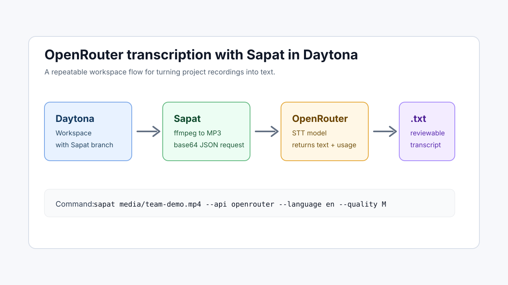

# Run OpenRouter Transcription with Sapat

## Introduction

Project recordings are useful only when the team can search, quote, and reuse
what was said. Demo videos, design reviews, customer calls, and engineering
standups often contain decisions that never make it into tickets. A small
[speech-to-text API](/definitions/20260528_definition_speech_to_text_api.md)
workflow can turn those recordings into reviewable text before the context is
lost.

This guide shows how to run [Sapat](https://github.com/nkkko/sapat) in a
[Daytona workspace](</definitions/20240819_definition_daytona workspace.md>)
with an OpenRouter transcription provider. Sapat handles local media conversion
with `ffmpeg`, calls the selected transcription API, and writes a `.txt` file
next to the source video. Daytona keeps that setup reproducible so another
engineer can open the same repository, install the same package, and repeat the
run without rebuilding the environment from memory.

The OpenRouter provider used in this guide is implemented in the companion
Sapat pull request: [nibzard/sapat#56](https://github.com/nibzard/sapat/pull/56).
It uses OpenRouter's documented `POST /api/v1/audio/transcriptions` endpoint,
sending base64 audio plus a model name such as `openai/whisper-large-v3`.



## TL;DR

- Create a Daytona workspace for Sapat and check out the OpenRouter provider
  branch until the upstream PR is merged.
- Add `OPENROUTER_API_KEY`, `OPENROUTER_MODEL`, and the transcription endpoint
  to a local `.env` file.
- Install Sapat in editable mode, confirm `--api openrouter` is available, and
  run it against an `.mp4` file.
- Validate the output by checking the generated `.txt` transcript and rerun with
  lower audio quality if the request is too large.

## Prerequisites

You need the following before starting:

- Daytona installed locally. If it is not installed yet, run:

```bash
curl -L https://download.daytona.io/daytona/install.sh | sudo bash
```

- An OpenRouter API key with enough credits for speech-to-text requests.
- A short `.mp4` recording to test with. Start with one to three minutes of
  audio so you can validate the flow before running a large batch.
- `ffmpeg` available in the workspace. Sapat uses it to extract audio from the
  video before calling the transcription provider.

OpenRouter's transcription API expects a bearer token, a base64 encoded audio
payload, a speech-to-text model identifier, and optional settings such as
`language` and `temperature`. The endpoint returns a JSON response containing
the transcribed `text` and usage metadata.

## Step 1: Create the Daytona Workspace

Create a workspace from the Sapat repository:

```bash
daytona create https://github.com/nkkko/sapat --code
```

Until the OpenRouter provider is merged upstream, fetch the companion branch
inside the workspace:

```bash
git fetch https://github.com/Davidrsdiaz/sapat-income-experiment.git \
  codex/openrouter-sapat-provider
git checkout FETCH_HEAD
```

Install Sapat in editable mode:

```bash
python -m pip install -e .
```

Confirm that the command is available:

```bash
sapat --help
```

The provider branch adds `openrouter` to the `--api` choices. If the help text
only lists `openai`, `groq`, and `azure`, check that you are on the provider
branch and rerun the editable install.

## Step 2: Configure OpenRouter

Create a local `.env` file in the Sapat workspace:

```bash
cat > .env <<'EOF'
OPENROUTER_API_KEY=replace_with_your_key
OPENROUTER_MODEL=openai/whisper-large-v3
OPENROUTER_API_ENDPOINT=https://openrouter.ai/api/v1/audio/transcriptions
OPENROUTER_HTTP_REFERER=https://github.com/nkkko/sapat
OPENROUTER_APP_TITLE=Sapat
EOF
```

Keep `.env` local. Do not commit it. The provider reads these values at runtime
with `python-dotenv`:

| Variable | Purpose |
| --- | --- |
| `OPENROUTER_API_KEY` | Bearer token used to authenticate the request. |
| `OPENROUTER_MODEL` | Speech-to-text model identifier sent to OpenRouter. |
| `OPENROUTER_API_ENDPOINT` | Defaults to OpenRouter's transcription endpoint. |
| `OPENROUTER_HTTP_REFERER` | Optional attribution header for OpenRouter. |
| `OPENROUTER_APP_TITLE` | Optional app title header for OpenRouter. |

The current provider intentionally sends only fields documented by OpenRouter's
transcription endpoint: audio data, audio format, model, language, and
temperature. Sapat's `--prompt` option is useful with some providers, but this
OpenRouter endpoint does not currently document a prompt field for
transcription.

## Step 3: Run a First Transcription

Place a test video in the workspace, for example:

```bash
mkdir -p media
cp ~/Downloads/team-demo.mp4 media/team-demo.mp4
```

Run Sapat with OpenRouter:

```bash
sapat media/team-demo.mp4 \
  --api openrouter \
  --language en \
  --quality M \
  --temperature 0.2
```

Sapat does four things:

1. Converts `media/team-demo.mp4` into a temporary MP3 file.
2. Base64 encodes that MP3 for OpenRouter's JSON transcription request.
3. Sends the request to `https://openrouter.ai/api/v1/audio/transcriptions`.
4. Writes the returned `text` field to `media/team-demo.txt`.

Open the generated transcript:

```bash
sed -n '1,80p' media/team-demo.txt
```

For a first pass, look for obvious structural quality: correct language,
speaker topic continuity, missing sections, and repeated hallucinated phrases.
If the transcript is empty or truncated, reduce the input length and rerun
before changing models.

## Step 4: Tune the Workflow

Sapat's `--quality` option controls the temporary MP3 created by `ffmpeg`.
OpenRouter receives the encoded MP3, so quality affects upload size and
recognition detail.

| Quality | Best for | Tradeoff |
| --- | --- | --- |
| `L` | Fast checks, long calls, noisy experiments | Smaller payload, less detail. |
| `M` | Most team recordings | Balanced size and clarity. |
| `H` | Short clips where detail matters | Larger payload and higher request risk. |

For routine project notes, start with `M`. Use `L` for long recordings or when
you hit provider request limits. Use `H` only when the source audio is short and
clean enough to justify the larger payload.

Sapat also supports directory input. If you have a folder of recordings:

```bash
sapat media/ \
  --api openrouter \
  --language en \
  --quality M \
  --temperature 0.2
```

The current command processes `.mp4` files in that directory. Keep the first
batch small so you can confirm output quality and cost before processing a full
archive.

## Step 5: Add Review Guardrails

Raw transcripts are useful, but they should not be treated as final records
without a quick human pass. Speech-to-text systems can miss product names,
collapse similar speaker voices, or invent punctuation that changes emphasis.
For engineering work, the safest pattern is to separate transcription from
approval:

1. Store the original recording and generated transcript side by side.
2. Add a short review note at the top of the transcript with the recording date,
   source, reviewer, and provider model.
3. Search for names, acronyms, ticket IDs, and product terms that are easy for
   speech models to mishear.
4. Quote important decisions only after checking the relevant section of the
   source recording.

For example, after Sapat writes `media/team-demo.txt`, create a reviewed copy:

```bash
cp media/team-demo.txt media/team-demo.reviewed.txt
```

Then add a small header before sharing it:

```text
Recording: team-demo.mp4
Provider: OpenRouter openai/whisper-large-v3
Reviewer: your-name
Status: reviewed for project names and action items
```

This extra step is especially useful when transcripts feed downstream LLM
summaries. If the transcript is wrong, the summary will usually sound confident
anyway. Keeping a reviewed transcript gives the team a better source of truth
and makes later corrections easier to audit.

## Step 6: Validate the Provider Branch

The companion implementation includes mocked tests. They do not call
OpenRouter, so you can run them without spending API credits:

```bash
python -m unittest discover -s tests -v
python -m compileall src tests
git diff --check
```

The tests cover request construction, base64 payload encoding, missing
configuration, unsupported audio extensions, and CLI routing for
`--api openrouter`.

You can also confirm the CLI wiring directly:

```bash
sapat --help | grep openrouter
```

That check should print the API choice list containing `openrouter`.

## Common Issues and Troubleshooting

### `OPENROUTER_API_KEY is required`

The provider did not find your key in the environment. Check that `.env` is in
the repository root where you run `sapat`, and confirm there is no extra spacing
around the variable name:

```bash
grep OPENROUTER_API_KEY .env
```

### OpenRouter Returns 401 or 402

A `401` response usually means the key is missing or invalid. A `402` response
means the account cannot pay for the request. Check the key in the OpenRouter
dashboard and confirm the account has credits before rerunning.

### The Request Fails on a Long Recording

The provider branch keeps Sapat's 25 MB audio-file guard. If the generated MP3
is too large, split the source recording or rerun with lower quality:

```bash
sapat media/team-demo.mp4 --api openrouter --language en --quality L
```

For long meetings, transcribing smaller segments is also easier to review and
retry.

### `--correct` Raises an Error

Do not pass `--correct` with the OpenRouter provider branch yet. The branch adds
speech-to-text transcription only. If you need a cleanup pass, run the raw
transcript through your preferred chat model after Sapat writes the `.txt` file.

### The Transcript Mentions the Wrong Terms

OpenRouter's transcription endpoint currently documents language and
temperature, not a custom prompt field. For product names, acronyms, and
customer-specific vocabulary, keep a short post-processing checklist next to the
recording. Search the generated `.txt` for those terms before sharing the
transcript.

## Conclusion

With Daytona, Sapat, and OpenRouter, you can turn project recordings into
text from a reproducible workspace instead of a one-off local script. Daytona
keeps the environment repeatable, Sapat standardizes media conversion and file
output, and OpenRouter gives you a single speech-to-text endpoint that can be
configured by model.

The practical workflow is simple: create the workspace, add OpenRouter
credentials to `.env`, run Sapat on a short recording, inspect the `.txt`, then
scale to a small batch once the quality and cost look right.

## References

- [OpenRouter transcription API documentation](https://openrouter.ai/docs/api/api-reference/transcriptions/create-audio-transcriptions)
- [Sapat repository](https://github.com/nkkko/sapat)
- [OpenRouter Sapat provider PR](https://github.com/nibzard/sapat/pull/56)
- [Daytona repository](https://github.com/daytonaio/daytona)
